










<a href="https://github.com/XaviFortes/MetalMC"></a>
<a href="https://github.com/XaviFortes/otel-stream-router"></a>
<a href="https://github.com/XaviFortes/shellnet-infrastructure"></a>
<a href="https://github.com/XaviFortes/DeckSaves"></a>
<a href="https://github.com/XaviFortes/IPTables-DDOS-Protection"></a>
<a href="https://github.com/XaviFortes/tesla-tracker"></a>

<a href="https://github.com/XaviFortes?tab=repositories&sort=stargazers">▸ full repository index</a>




<!--
  Panels regenerate themselves:
    assets/gen/*     tools/xfos-cards.py    — daily, GitHub GraphQL API
    metrics/*        lowlighter/metrics     — daily, .github/workflows/metrics.yml
    snake.svg        Platane/snk            — daily, pushed to the `output` branch
    assets/*.svg     tools/xfos-assets.py   — static chrome, rerun by hand
-->
